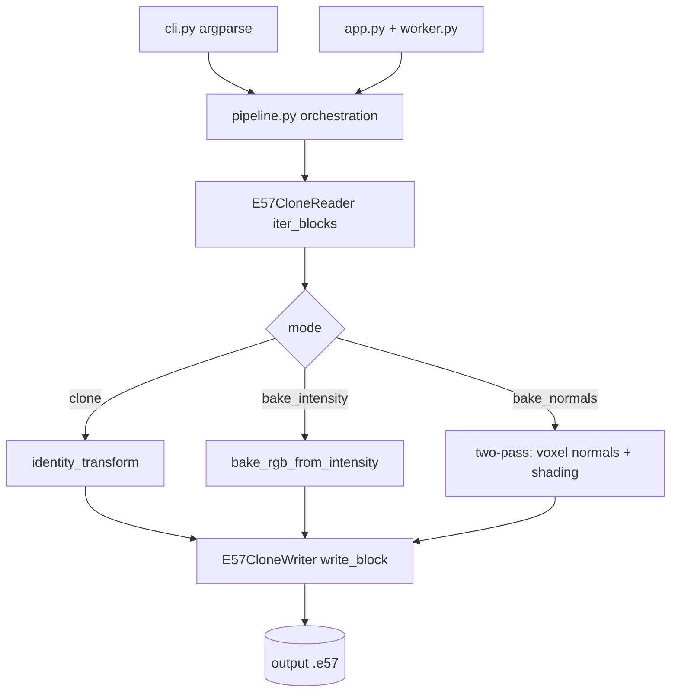
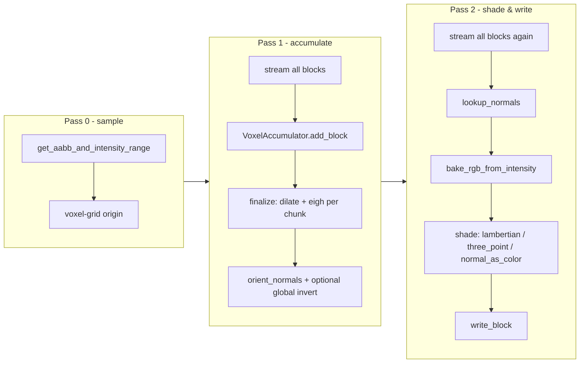

# Architecture

Intensity-RGB is layered in four "waves". The lower waves are Qt-free and independently testable; only Wave 4 touches PySide6.

| Wave | Layer | Modules |
|---|---|---|
| 1 | Pure-numpy processing | `processing/intensity.py`, `processing/voxel_normals.py`, `processing/shading.py`, `processing/orientation.py` |
| 2 | Streaming I/O substrate | `io/e57_clone.py` over the vendored `pye57` fork |
| 3 | Qt-free orchestration | `pipeline.py`, `capability.py`, `cli.py` |
| 4 | Desktop GUI | `app.py` (QMainWindow), `worker.py` (QThread) |

Both the GUI and the CLI call into the same `pipeline.py` — there is one integration surface. See [[Module Map]] for per-module detail.

## End-to-end flow

## The two-pass shading flow (bake_normals)

When shading is enabled, the pipeline runs **two streaming passes** over the file (see [[Streaming IO Model]] and [[Voxel Normals and PCA]]):

This two-pass structure is significant for [[Classification Colouring|classification]]: **Pass 1 already builds a per-voxel statistical model of the whole cloud** (covariance moments). That is exactly where per-voxel classification features would be computed — at no extra pass cost. See [[Recommended Approach]].

## Design properties

- **Memory-flat:** RAM is bounded by `block_size` × field width + the voxel grid (bounded by scene AABB / voxel size), not by total point count. See [[Constraints and Scale]].
- **Faithful round-trip:** the writer preserves field dtype, scale/offset, and vendor-extension subtrees; only the RGB columns are rewritten.
- **Cancellable:** a `threading.Event` cancel flag is polled during streaming (raises `PipelineCancelled`).

## Related

- [[Module Map]] · [[Streaming IO Model]] · [[Voxel Normals and PCA]] · [[Project Overview]]
