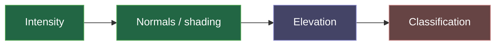

# Recolour Roadmap

Intensity-RGB recolours points by mapping some per-point quantity to a colour. Today that quantity is **intensity** (optionally shaded by **normals**). The goal is to add **elevation** and ultimately **semantic class**.

| Mode | Status | Note |
|---|---|---|
| Intensity | ✅ current | [[Intensity Colouring]] |
| Normals (Lambertian / three-point / normal-as-colour) | ✅ current | [[Normal-based Colouring]] |
| Elevation | 🔜 planned | [[Elevation Colouring]] — cheapest next mode |
| Classification | 🎯 strategic goal | [[Classification Colouring]] |

## Sequencing rationale

- **Elevation is nearly free** — it is a direct function of `cartesianZ`, already in every block. It needs only a colour ramp and a min/max (which [[Module Map|get_aabb_and_intensity_range]] already estimates). A good warm-up that establishes the "colour-by-a-scalar" UI pattern that classification will reuse.
- **Classification is the strategic prize** but the largest effort. The [[Recommended Approach]] sequences it into phases P0–P4 so value lands early (rule-based floor/wall/ceiling) before any training is required. See [[Classification Roadmap]].

## Related

- [[Classification Colouring]] · [[Recommended Approach]] · [[Classification Roadmap]]
