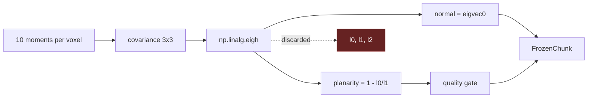

# Voxel Normals and PCA  ★

> [!important] The load-bearing finding for classification
> `finalize_chunk` in `processing/voxel_normals.py` computes the per-voxel covariance eigenvalues with `np.linalg.eigh`, uses two of them to derive `planarity`, then **discards all three eigenvalues** — the returned [[Module Map|FrozenChunk]] stores only `normals`, `quality`, and `means`. Those eigenvalues are precisely the input to the [[Geometric Features (Weinmann)|Weinmann geometric features]] that every CPU-only classifier needs. Retaining them is the cheapest possible on-ramp to [[Classification Colouring|classification]] — see [[ADR-003 Retain voxel eigenvalues]].

## How normals are computed

### Pass 1 — accumulate 10 moments per voxel
`VoxelAccumulator.add_block(xyz)` scatters, per voxel, a 10-vector:

```
[ count, Σx, Σy, Σz, Σxx, Σxy, Σxz, Σyy, Σyz, Σzz ]
```

summed with `np.add.at` on flat voxel indices. Voxels are grouped into dense `32³` **chunks** (`CHUNK = 32`); only touched chunks exist in the moments dict, so RAM tracks the occupied scene volume, not the bounding box.

### Dilation
Voxels with `0 < count < min_support` (default 8) pull moments from their 26-connected neighbours (which may cross chunk boundaries) in a single non-iterative pass, so thin/sparse surfaces still get a normal.

### Pass 2 — compact-then-eigh (`finalize_chunk`)
Per valid voxel (`count ≥ min_support`):

1. centroid `μ = Σxyz / n`
2. covariance `C = (Σ_outer / n) − μμᵀ`, symmetrised
3. `eigvals, eigvecs = np.linalg.eigh(C)` — **ascending** eigenvalues `λ0 ≤ λ1 ≤ λ2`
4. **normal** = `eigvecs[:, 0]` (smallest-eigenvalue direction)
5. **planarity** = `1 − λ0 / max(λ1, 1e-12)`
6. **quality** = `count ≥ min_support` AND `planarity ≥ planarity_threshold` (default 0.5)

The `FrozenChunk` keeps `normals`, `quality`, `means`. `λ0, λ1, λ2` are **not persisted** (and `λ2` isn't even read).



## Why this matters

The eigenvalues `λ0 ≤ λ1 ≤ λ2` directly yield linearity `(λ2−λ1)/λ2`, planarity `(λ1−λ0)/λ2`, sphericity `λ0/λ2`, anisotropy, omnivariance, eigenentropy, and change-of-curvature — the canonical discriminators between walls (planar), pipes/edges (linear), and clutter (spherical). Combined with **verticality** (already available from the oriented normal vs. up-vector) and **height** (from `means.z` + a cheap global Z-histogram), this is a complete [[Geometric Features (Weinmann)|feature vector]] computed with **zero extra passes** — Pass 1 already visits every point.

This is the foundation of [[Recommended Approach|the recommended classification path]].

## Tunables

| Param | Default | Effect |
|---|---|---|
| `voxel_size` | 0.5 m | feature/normal resolution |
| `chunk` | 32 | voxels per axis per chunk (32³) |
| `min_support` | 8 | min points per voxel for a normal |
| `planarity_threshold` | 0.5 | quality gate |

## Related

- [[Geometric Features (Weinmann)]] · [[ADR-003 Retain voxel eigenvalues]] · [[Recommended Approach]] · [[Streaming IO Model]]
