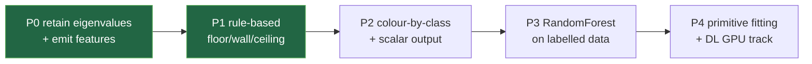

# Classification Roadmap

Phased rollout of the [[Recommended Approach]]. Each phase is independently shippable and ordered so **value lands before any training is required**. Effort is relative (S/M/L), not a commitment.

## P0 — Retain eigenvalues + emit features  (effort: S)
**Goal:** make the geometric feature vector available; no behaviour change yet.
- Persist `FrozenChunk.eigvals (C,C,C,3) f32` in `processing/voxel_normals.py:finalize_chunk` ([[ADR-003 Retain voxel eigenvalues]]).
- Add a `features.py` (or extend `voxel_normals.py`) computing the [[Geometric Features (Weinmann)|Weinmann features]] from the eigenvalues + normal.
- Add a global Z-histogram accumulator in Pass 1.
- **Touches:** `processing/voxel_normals.py`, new `processing/features.py`, `tests/test_voxel_normals.py` (+ feature tests).
- **Exit:** features computed and unit-tested on the synthetic plane/sphere fixtures; RAM/throughput unchanged (verify with [[Constraints and Scale|capability]] estimates).

## P1 — Rule-based floor/wall/ceiling colouring  (effort: S–M)
**Goal:** first classification colouring, **no training, no new dependencies**.
- Rule layer: verticality + planarity + Z-histogram modes → {floor, ceiling, wall, clutter} ([[Recommended Approach]] Pass B step 1).
- New colour-by-class LUT path in the Pass-2 write (reuse the [[Elevation Colouring|colour-by-scalar UI pattern]]).
- Add `--colour-by classification` (CLI) + GUI mode.
- **Touches:** new `processing/classification.py`, `pipeline.py`, `cli.py`, `app.py`/`worker.py`, tests.
- **Exit:** a baked scan shows walls/floors/ceilings in distinct colours; verified visually + on synthetic fixtures.

## P2 — Colour-by-class + per-point class scalar in `.e57`  (effort: M)
**Goal:** persist the class, not just the colour.
- Write class id as a per-point scalar field — resolve the prototype-node question in [[ADR-005 Per-point classification scalar in E57]] (or ship the sidecar-file fallback first).
- **Touches:** `io/e57_clone.py` (possibly `vendor/pye57`), `pipeline.py`, tests (round-trip the scalar).
- **Exit:** output `.e57` carries a readable `classification` scalar (or sidecar), round-trip tested.

## P3 — RandomForest classifier  (effort: M–L)
**Goal:** the full [[Target Class Taxonomy|Level-1 taxonomy]] beyond what rules can do (beam/column/duct/tray/equipment).
- Add **scikit-learn** dependency. Offline training script on a small hand-labelled set ([[Annotation Tools]]) and/or synthetic-from-IFC data ([[Datasets and Benchmarks]]).
- Per-block `model.predict(features)` in Pass 2; ship a pickled default model.
- **Touches:** new training script (out of streaming core), `processing/classification.py`, packaging (bundle the model), tests.
- **Exit:** held-out per-class accuracy reported; inference stays memory-flat and per-block.

## P4 — Primitive fitting + DL GPU track  (effort: L)
**Goal:** instances (pipe runs, vessels) and the fine classes.
- Open3D/PCL cylinder + plane fitting on flagged clusters → pipe/vessel instances; cross-block reconciliation ([[Plant and Piping Methods]]).
- Optional offline **GPU deep-learning** pass (Open3D-ML, MIT) for valve/pump/flange — entirely separate from the streaming core ([[ADR-002 Defer deep learning to GPU track]]).
- **Exit:** pipe instances extracted with diameters; DL track documented as an optional offline tool.

## Related

- [[Recommended Approach]] · [[Target Class Taxonomy]] · [[Classification Colouring]] · decisions in `30-Plan/decisions/`
