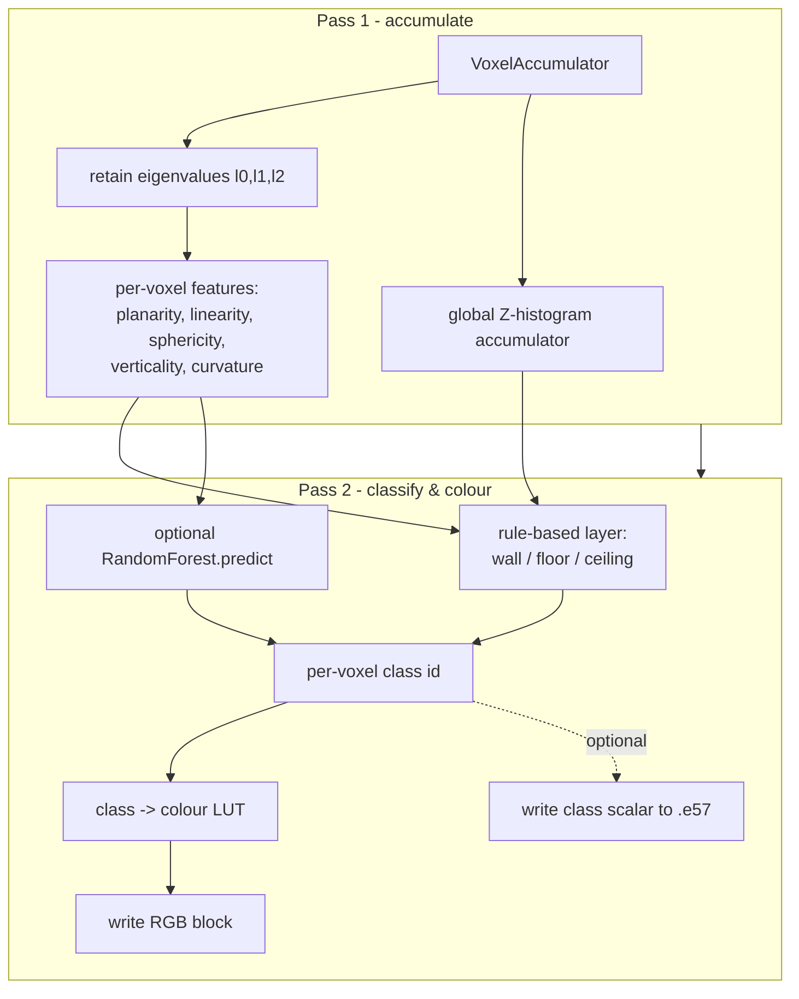

# Recommended Approach

**Classical-geometric-first**, built on top of the [[Voxel Normals and PCA|voxel PCA the tool already runs]]. Deep learning is kept as a separate optional offline GPU track ([[ADR-002 Defer deep learning to GPU track]]). This is the synthesis of all four research sweeps ([[Method Comparison]]) against the [[Constraints and Scale|hard constraints]].

## Why this path

1. Every CPU-only, streaming-feasible, label-free method in the literature is **geometric** ([[Classification MOC]]).
2. The tool already computes per-voxel covariance eigenvalues and **throws them away** — retaining them is a ~15-line change that unlocks the entire [[Geometric Features (Weinmann)|Weinmann feature set]] at **zero extra pass cost**.
3. Mature commercial tools (EdgeWise, Cyclone 3DR) use exactly this geometric extraction for pipes/steel ([[Plant and Piping Methods]]).
4. There is **no open labelled plant dataset** ([[Datasets and Benchmarks]]), so a label-hungry DL-first path would stall on data before it started.

Recorded in [[ADR-001 Classical-geometric-first]].

## The pipeline

### Pass A — feature accumulation (extends `voxel_normals.py`)
Persist `FrozenChunk.eigvals (C,C,C,3) f32` ([[ADR-003 Retain voxel eigenvalues]]) and emit the [[Geometric Features (Weinmann)|feature vector]] per voxel. Simultaneously update **one** global coarse **Z-histogram** (bounded memory) for floor/ceiling mode detection. No new pass — Pass 1 already visits every point.

### Pass B — labelling (mirrors the existing two-pass shading)
1. **Rule-based structural layer (no training, ship immediately):**
   - planar + vertical → **wall**
   - planar + horizontal + Z near histogram low mode → **floor**; high mode → **ceiling**
   - high linearity → **edge/pole**; high sphericity → **clutter**
   This alone gives floor/wall/ceiling/clutter on billion-point scans with **zero new dependencies**.
2. **Optional ML layer:** a pickled **scikit-learn RandomForest** (Semantic3D recipe — geometry only) called per block: `model.predict(features)`. Fully streaming, memory-flat.
3. **Optional primitive refinement:** Open3D/PCL cylinder + plane fitting on flagged voxel clusters → **pipes / vessels** instances; reconcile plane/axis params across blocks in a cheap post-pass.

### Output
Map class id → colour LUT → write the RGB columns (the existing write path). Optionally also write the class id as a [[ADR-005 Per-point classification scalar in E57|per-point scalar]].

## What this delivers vs. defers

| Delivered (CPU, classical) | Deferred (GPU/DL or heuristic) |
|---|---|
| floor, ceiling, wall (rules) | valve, flange, pump (fine classes) |
| pipe, vessel/tank (cylinder fit) | high-accuracy instance segmentation |
| beam, column, duct, tray (planes + RF) | rich learned semantics |
| clutter/other | |

Fine classes wait for the [[Deep Learning Methods|DL track]] or rule-based pipe-graph heuristics ([[Plant and Piping Methods]]).

## Dependencies

numpy/scipy (present), **scikit-learn** (new, BSD, pure-pip), optionally **Open3D** (MIT) for plane RANSAC. All permissive. Avoid CGAL (GPL) and PCL python bindings in-loop ([[Method Comparison]]).

## Sequenced delivery

See [[Classification Roadmap]] for phases P0–P4 with exit criteria and the files each touches.

## Related

- [[Classification Roadmap]] · [[Target Class Taxonomy]] · [[Voxel Normals and PCA]] · [[Geometric Features (Weinmann)]] · [[ADR-001 Classical-geometric-first]]
